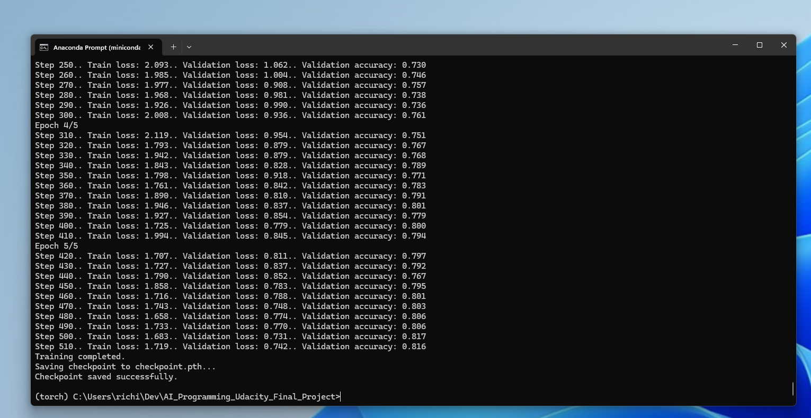

# Flower Image Classifier


*Image showing the predicted flower name and corresponding probabilities.*

## Overview

The goal of this project is to develop an image classifier for recognizing different species of flowers using deep learning techniques. The project involves building and training a deep neural network on a flower dataset, then converting the model into a command-line application.

## Acknowledgments

This project is a part of the Udacity AI Programming with Python Nanodegree.  My Nanodegree was paid for by the Bertelsmann Next Gen Tech Booster Scholarship. 

The scholarship program works as follows:.
1. **Challenge Course**: 17,000 selected applicants enroll in a foundational course for their chosen track. AI and cybersecurity tracks include technical assessments.
2. **Scholarship Recipients Announced**: The top 500 performers from each challenge course are awarded a Nanodegree program scholarship.

The guidance and resources from Udacity were instrumental in the development of this project.

## Project Structure

The project consists of two main parts:
1. **Development in Jupyter Notebook**: Implementing the image classifier using PyTorch.
2. **Command Line Application**: Converting the model into a command-line application for training and predicting.

### Part 1: Development in Jupyter Notebook

This notebook contains code to:
- Load and preprocess the dataset.
- Train the image classifier.
- Save the trained model as a checkpoint.
- Use the trained model for making predictions.

### Part 2: Command Line Application

The Command Line Implementation of this neural net requires running two scripts.
- `train.py`: Trains a new network on a dataset and saves the model as a checkpoint.
- `predict.py`: Uses a trained network to predict the class for an input image.

Additionally, there are utility functions and model functions split into `utilities.py` and `model.py` respectively.

I also added a gpu_check.py for anyone on CUDA systems who wants to validate that the model will train on GPU instead of CPU in their environment before running the train.py script.

I trained the neural net on a 4090RTX and got good results.  As the checkpoint files I created during testing are each huge, a .gitignore keeps it out of this repository.

## Installation

### Setting Up the Environment

1. **Create a New Conda Environment**:
    ```sh
    conda create -n torch python=3.8
    ```

2. **Activate the New Environment**:
    ```sh
    conda activate torch
    ```

3. **Install Required Libraries**:
    ```sh
    conda install pytorch torchvision torchaudio pytorch-cuda=12.1 -c pytorch -c nvidia
    conda install numpy matplotlib seaborn pandas
    ```

# Usage


### Training the Model



To train the model, run the `train.py` script with the following command:
```sh
python train.py <data_directory> --save_dir <save_directory> --arch <architecture> --learning_rate <learning_rate> --hidden_units <hidden_units> --epochs <epochs> --gpu
```

Example Command

```sh
python train.py flowers --save_dir checkpoint.pth --arch vgg16 --learning_rate 0.001 --hidden_units 512 --epochs 5 --gpu
```

### To Make Predictions With The Model
```sh
python predict.py <input_image> <checkpoint> --top_k <top_k> --category_names <category_names> --gpu
```

Example Command

```sh
python predict.py test_image.jpg checkpoint.pth --top_k 5 --category_names cat_to_name.json --gpu
```

# Files Included:
- `train.py`: Script to train the model.
- `predict.py`: Script to make predictions using the trained model.
- `utilities.py`: Contains utility functions for data loading and image processing.
- `model.py`: Contains functions to build and load the model.
- `gpu_check.py`: Script to check if the CUDA environment is set up correctly.
- `Test_Image.jpg`: An example image to test the model.
- `cat_to_name.json`: JSON file to map category indices to flower names.